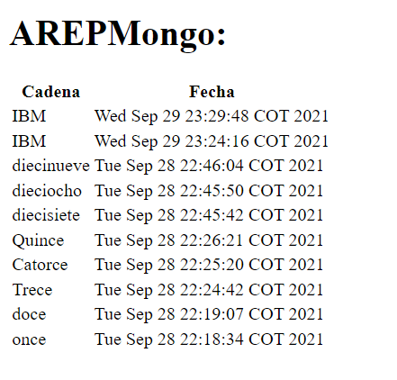

# TALLER DE DOCKER Y AWS

El taller es una aplicación web usando Spark java. Esta aplicación se construyo en un container
para docker para la aplicación, se desplegó y se probó en una maquina local. Por ultimo se desplegó
el contenedor que se creo en una maquina virtual EC2 en AWS con Docker instalado

## Autor
* Juan Pablo Espinosa

## Contrucción
* Visual Studio Code - Editor de código y ambiente de desarrollo
* Maven - Gestor de dependencias
* BootStrap


## Prerequisites
* Docker - Container Manager
* Java 8 - Development Environment
* Git - Version Control System
* Spark - Micro framework for creating web applications in Java 8

## Screenshots

Pantalla Principal


Insertar dato


Ultimos 10 Logs



AWS Despliegue


## Instrucciones

1. Clonar el repositorio

```
ggit clone https://github.com/Juancode-Espi/ArepDocker
```

2. Compilar/Construir el proyecto

```
mvn clean install
```

3. Ejecutar el docker compose

```
docker-compose up -d
```

4. Ahora la aplicación deberia funcionar al correrla con

```
java -cp "target/classes:target/dependency/*" co.edu.escuelaing.virtualization.dockerdemo.SparkWebServer
```

